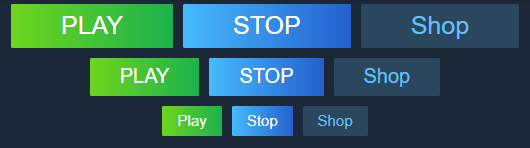
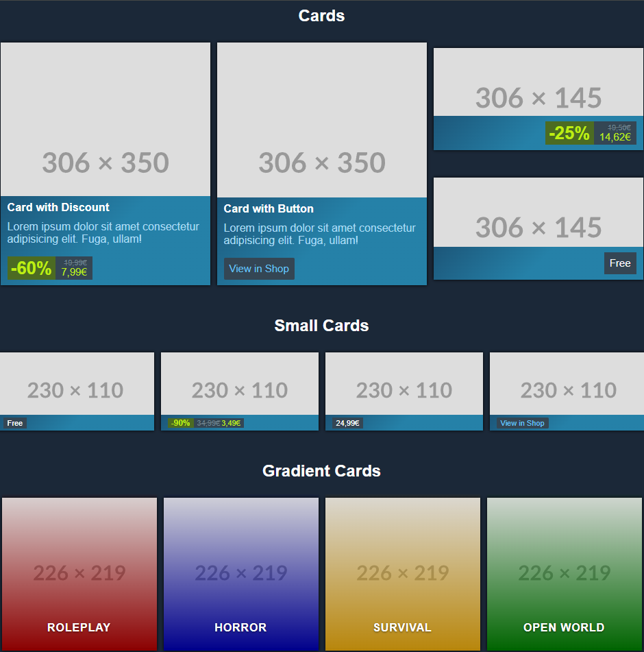
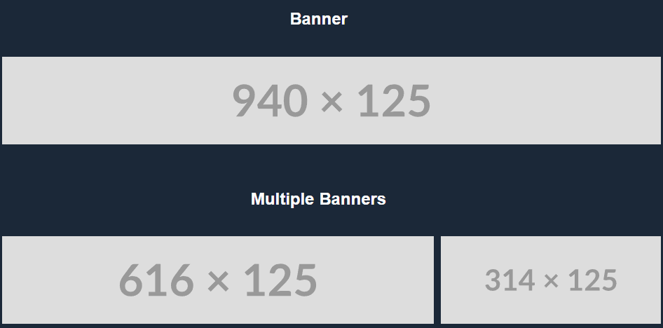

# steam inspired ui library

This CSS library is inspired by the styles used on the steam website and the steam client.

## Usage

You can either download the whole repository and add `steamui.css` and `/css/utlities.css` to your HTML or download only the components you want to use and import them manually.

All components except from the navbar should only be used inside a div with the class `page-container`.
```html
<div class="page-container">
    <div class="menubar">
        <!-- insert menubar here -->
    </div>
    <!-- insert more content here -->
</div>
```

### Import All

```html
<head>
    <link rel="stylesheet" href="./css/utilities.css">
    <link rel="stylesheet" href="steamui.css">
</head>
```

### Import individually

```html
<head>
    <link rel="stylesheet" href="./css/utilities.css">
    <link rel="stylesheet" href="./css/main.css">
    <link rel="stylesheet" href="./css/__buttons.css">
    <link rel="stylesheet" href="./css/__navbar.css">
</head>
```
Note that `./css/main.css` needs to be imported because it contains important variables for the other components.

If you want to use carousels also add
```html
<script src="./js/__carousel.js" defer></script>
```

## Components
See the components in action at https://projects.fabian-kleine.dev/steam-inspired-ui-library/
### Buttons



Always use the `.btn` class!

#### Varaints

Primary Secondary and Tertiary Button as in the Image

```html
<button class="btn btn-primary">PLAY</button>
<button class="btn btn-secondary">STOP</button>
<button class="btn btn-tertiary">Shop</button>
```

Large Buttons

```html
<button class="btn btn-primary btn-lg">PLAY</button>
<button class="btn btn-secondary btn-lg">STOP</button>
<button class="btn btn-tertiary btn-lg">Shop</button>
```

Small Buttons

```html
<button class="btn btn-primary btn-sm">PLAY</button>
<button class="btn btn-secondary btn-sm">STOP</button>
<button class="btn btn-tertiary btn-sm">Shop</button>
```

Button Styles can also be used with anchors:

```html
<a href="#" class="btn btn-primary">PLAY</a>
<a href="#" class="btn btn-secondary">STOP</a>
<a href="#" class="btn btn-tertiary">Shop</a>
```

### Navbar


```
└── nav.navbar
    └── div.navbar-container
        ├── div.navbar-toggler
        │   └── label.navbar-toggle-icon for="navToggle"
        ├── div.navbar-logo
        │   └── a
        │       └── img
        ├── input:checkbox#navToggle
        └── ul.navbar-nav
            ├── li.navbar-item.active
            │   ├── a.navbar-link
            │   └── div.navbar-dropdown
            │       ├── a.dropdown-link
            │       ├── a.dropdown-link
            ├── li.navbar-item
            │   ├── a.navbar-link
            │   └── div.navbar-dropdown
            │       ├── a.dropdown-link
            │       ├── a.dropdown-link
            ├── li.navbar-item
                └── a.navbar-link
```


The Navbar features dropwdowns and a responsive design.
Note that you can only use this component once since the id `#navToggle` for the responsive navbar toggler can only be used once.

### Menubar


```
└── div.menubar
    ├── div.menubar-item
    │   ├── a.menubar-link
    │   ├── div.menubar-dropdown
    │       ├── a.dropdown-link
    │       ├── h4.dropdown-subheader
    ├── div.menubar-item
    │   ├── a.menubar-link
    │   ├── div.menubar-dropdown.menubar-dropdown-grid
    │       ├── div.dropdown-grid-item
    │           ├── a.dropdown-link
    │           ├── h4.dropdown-subheader
    ├── div.menubar-item
    │   └── a.menubar-link
    ├── div.menubar-spacer
    └── div.menubar-search
        ├── input:search
        └── a.btn-search
            └── svg 
```
The Menubar is also responsive and features big dropdowns using the `menubar-dropdown-grid` class.

### Cards


#### Card with Discount
```
└── div.card
    ├── a
    │   └── img.card-img
    └── div.card-body
        ├── h5.card-title
        ├── p.card-text 
        └── div.card-price
            ├── div.card-price-discount
            └── div.card-discount-prices   
                ├── span.card-price-original 
                └── span.card-price-new         
```

#### Card with Button
```
└── div.card
    ├── a
    │   └── img.card-img
    └── div.card-body
        ├── h5.card-title
        ├── p.card-text 
        └── div.card-price
            └── a.btn.btn-card     
```
Note that you need to import `__buttons.css` to use this.

#### Card with normal pricetag and smaller image
```
└── div.card
    ├── a
    │   └── img.card-img
    └── div.card-body
        └── div.card-price.card-price-end
            └── span.card-pricetag         
```
The `.card-price-end` class moves the price to the right.
Discounts also work on cards with smaller images like shown in the first example.

#### Small Card
Just add the `.card-sm` class to the parent div.

#### Gradient Card
```
└── div.card.card-gradient style="--card-gradient-color: rgb(139,0,0)"
    └── a
        ├── img.card-img
        └── div.card-body
            └── h5.card-title
```
The `--card-gradient-color` variable set in style is the color for the gradient on the card body.

### Carousel
```
└── div.carousel#<carouselID>
    ├── button.carousel-previous onclick="carousel('<carouselID>', 'previous')"
    ├── div.carousel-slide.carousel-container 
    │   └── do what you want inside here
    └── button.carousel-next onclick="carousel('<carouselID>', 'next')"
```

The carousel id can be replaced by anything.

```html
<script>
    window.addEventListener("load", () => {
        carouselInit('<carouselID>')
    })
</script>
```
You need to Init the carousel on load.

Note that you need to import the script for the carousel
```html
<script src="./js/__carousel.js" defer></script>
```

### Banner


```
└── div.banner
    └── a
        └── img
```

#### Multiple Banners
```
└── div.banner.banner-grid
    ├── a
    │   └── img
    └── a
        └── img
```